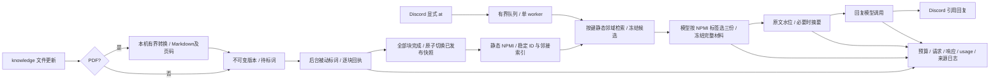

# Indeces_memory_manager

0.16.0 adds one model selection after static retrieval and before the final three
references. The normal Console supplies existing candidate IDs, topic labels and
NPMI/relevance scores to the model, validates its selected IDs, and freezes the
original complete quotes. It does not retrieve again or alter graph weights.
The selection stage is bounded to 4096 input tokens, 512 output tokens and 15
seconds by default; larger candidate pools use an explicitly audited ranked
prefix. Existing reply/summary/label budgets, the 130-second turn and one request
slot remain unchanged. Source updates do not reload an existing Console.


0.15.0 修复通用检索覆盖：Runtime 使用问题焦点/区分度标词、有界正文词索引和元数据降权；旧静态选择可显式回滚，图公式、Sol/medium及调用额度保持。摘要溢出或撞字符边界不提交checkpoint，原历史保留并明确声明上下文缺口；独立试算单独审计。详细规则与边界见 [RETRIEVAL_COVERAGE.md](docs/RETRIEVAL_COVERAGE.md)。
一个名为 **Indeces** 的小型 Python 无头智能体：一个 Discord Bot 连接、一个串行消息 worker、GPT-6.1-Sol adaptor、本地知识库、静态 NPMI 检索与动态观察历史，以及可检查的输入输出 scratch log。项目仓库名保留 `Indeces_memory_manager`。

0.13.2 增加须经 operator 明确授权的四篇有界维护入口：独立新账、发送前请求 ID、实际 usage 落盘、未知计量停整批、12 块试跑及完整事务发布。旧失败记录不重置；全局配置、模型、切块、标词和图规则保持。任务专属额度与恢复边界见 [维护合同](docs/BOUNDED_REINGEST.md)。

0.13.0 将静态检索接到持久数字 ID、按有向 ID 对建键的边、邻接/前缀/材料倒排索引。每次查询只读取命中标注词、一跳相关边和实际候选材料；选择、快照及审计冻结使用同一邻域树。NPMI、来源门控、一跳/top-k、去重、[M]、5 秒预算、并发和五轮规则保持。新 schema 与摄入维护见 [存储合同](docs/MEMORY_STORAGE.md)，交付验证见 [检查点](docs/CHECKPOINT.md)。摄入时的 NPMI 重算、启动迁移与独立全图观察仍可有完整 scope 成本；不能由查询路径的改变推断任意规模或真实 Discord 延迟已验收。

新图审计为 `schema_version=2`、`audit_scope=direct_hit_neighborhood_v1`，只冻结相关边、端点频次和原有的一跳接受/拒绝及排名证据；全图记录数/边数为摄入维护的标量。用户已明确批准关闭静态回复链的 dynamic/shadow 更新，旧动态行与旧事件保持；相关结果与证据在同一冻结动态状态下逐字节对照。审计整包和 hash 因范围与观察合同改变，不能声称整包逐字节相同。时间戳及 lazy decay 函数只作未激活的结构预留，不接入在线排序。详见 [运行记录](docs/RUN_RECORDS.md)。

历史 0.12.4 修复 `fixed_context_too_large` 的模型材料组装问题：当时完整图证据和支持记录清单保留在 scratch，模型改用明确版本的材料视图，保留完整 quote、来源、[M]、页码、标注词及排序摘要。此视图仍保留；真实过大的输入仍受原门禁限制。

历史 0.12.3–0.12.6 逐步增加缓存与相关边物化，但当时完整 shadow 更新/频次/审计冻结仍有全局成本。旧测量与未应用的 lazy shadow 设计保留在 [历史查询范围说明](docs/MEMORY_QUERY_SCOPE.md)；当前实现与该设计不同，以 0.13.0 的 [存储合同](docs/MEMORY_STORAGE.md) 为准。

0.12.2 修复机器人失败时缺少错误回执，并让检索、scratch 与材料冻结共享不可变审计快照，减少重复序列化。已准入消息发生检索/模型失败时返回固定错误提示，机器人回执不提及对方、不触发接续；收尾 `skip` 仍静默。完整证据、5 秒本地预算和原模型额度保持。

0.12.0 增加与其他 Discord 机器人的有限对话：同一频道、同一个机器人最多 5 次回应机会；模型可对收尾消息选择静默跳过。次数跨重启保留，人类在该频道再次显式 `@Indeces` 后重置。0.11.0 的单 Console、摄入审计与续跑功能保持。职责、状态归属与验证边界见 [架构合同](docs/ARCHITECTURE.md)。新代码在新进程加载后生效，不自动停止或重启已有服务。

当前交付、远端提交、CI 与未验收项目见 [检查点](docs/CHECKPOINT.md) 和 [交付状态](docs/STATUS.md)。历史 CI 通过不代表 0.13.0 已加载，也不能代替真实模型、Discord 或召回质量验收。

项目使用 [MIT 许可证](LICENSE)，上游策略归属见 [第三方说明](THIRD_PARTY_NOTICES.md)。仓库只发布源码、空配置示例和合成离线验证记录；本地 API key、Bot token、加密凭据、原始材料、数据库和 scratch 不上传。提交前请按 [公开仓库与本地数据说明](docs/REPOSITORY_PRIVACY.md) 核验，`.gitignore` 不会移除已提交的历史。

只处理指定服务器、允许频道内显式 `@Indeces` 的文字消息，忽略自身和 webhook。人类消息沿用一条回复；其他机器人消息先在同一次回复模型调用中决定 `reply` 或 `skip`，收尾可静默跳过，无占位消息。按频道和机器人分别预占最多 5 次机会，跳过、失败、排队过期与停服丢弃也不退款；第 6 条不调用模型、不回复。人类新消息成功进入队列后重置该频道全部机器人的次数，重复消息不重置；无 @ 的消息、机器人消息和超时不重置。前 4 轮只定向提及对方机器人，第 5 轮不再提及；对方也必须允许机器人消息并显式 @Indeces 才能继续，不能保证对方会回复。

次数与接收去重状态存入已有 SQLite，跨 Gateway 重连和进程重启保留；首次新增表前先生成相邻 SQLite 备份，保留旧知识与聊天数据。机器人选择跳过仍会消耗该次模型请求的用量，并记录 `bot_reply_decision` 和 `skipped`，但没有送达回执；已准入机器人的检索/模型失败在剩余总轮时间内发送一条固定回执，关闭提及以免续接；时间耗尽则记录无法发送，不扩大预算。短期上下文仍按频道隔离，机器人聊天不入长期知识。没有工具执行、MCP、外部聊天 API、网页搜索、日程、主动发言或多 Gateway 路由；本机只读网页用于观察已有知识图和运行记录。

**聊天标词和聊天自动入库关闭。** 本地 `knowledge/` 中的 PDF、Markdown/UTF-8 文本文件更新触发后台被动入库。PDF 先在本机独立进程转换为带物理页码的 Markdown，再标词；无需额外模型调用。后台维护与回答是独立任务；当前模型传输共享一个串行请求槽，预算互不借用。



## 启动

需要 Python 3.12 或更新版本。Windows / CPython 3.12.14 的历史基线与本版验证进度见 [docs/STATUS.md](docs/STATUS.md)；Windows/Linux 离线 CI 已配置。

Windows 首次安装运行 `setup.cmd`，然后双击 `Indeces-Console.cmd`。已有本地 `.venv`，可直接打开 Console。

跨平台等价命令：

```powershell
python -m venv .venv
.\.venv\Scripts\python.exe -m pip install -r requirements.lock
.\.venv\Scripts\python.exe -m pip install --no-deps -e .
.\.venv\Scripts\python.exe -m indeces init
```

Linux 使用 `.venv/bin/python`。Windows 首次桥接可在 Console 输入 `discord`，或直接运行向导：

```powershell
.\.venv\Scripts\python.exe -m indeces discord
```

向导接收服务器 **Guild ID**、可选频道 ID 和隐藏输入的 **Bot token**。Guild ID 是目标服务器 ID；频道 ID 以逗号分隔，留空保留现有配置，输入 `*` 允许该服务器中所有符合显式 @ 条件的频道。向导展示不含 token 的设置预览，输入 `y` 才保存；取消不应用桥接设置。已有 runtime 持有同一 state 目录的实例锁时，向导拒绝修改。

Guild/频道设置写入 `config.local.toml`，名称同步为 `Indeces`；Bot token 只在 Windows 以当前用户 DPAPI 加密，保存到相邻的 `config.local.discord.secret`，并绑定该 Guild ID。它不能作为明文配置迁移到其他 Windows 用户或系统。密钥不进入配置、scratch 或仓库。终端无法保证隐藏输入时拒绝回显输入；损坏或不匹配的旧凭据可在向导里提供新 token 修复。其他平台没有持久化明文回退，可手动设置配置中的 Guild/频道 ID，并使用环境变量或启动时的隐藏输入。

在 Console 输入 `apikey`，或运行 `python -m indeces apikey`，进入 OpenAI API key 向导。隐藏输入 key，预览后输入 `y` 保存；留空可保留原来可解密的 key，损坏的旧 key 可替换修复。Windows 使用当前用户 DPAPI，独立保存到 `config.local.openai.secret`，不写进 TOML、scratch 或仓库。此凭据与 Discord token 分开保存，不绑定 Guild；两个向导都在同一 state 实例停止时配置。其他平台继续使用环境变量或启动时的会话隐藏输入，暂不支持持久保存。

**两个向导只做本地设置，不验证远端密钥是否有效，也不启动服务。** 完成后在 Console 明确执行 `start`。Discord token 来源按 `DISCORD_BOT_TOKEN` → 与配置 Guild 匹配的已保存 token → 本次会话隐藏输入选择；OpenAI key 按 `OPENAI_API_KEY` → 已保存 OpenAI key → 会话隐藏输入选择。环境变量存在时优先使用，向导会提示这一点；损坏的保存文件需要用相应向导修复，不静默换用会话 key。不读取 Yuki 的秘密配置。`.env.example` 只说明变量名，不自动加载 `.env`。密钥按 [OpenAI 认证文档](https://developers.openai.com/api/reference/overview) 的服务端秘密处理。

```powershell
.\.venv\Scripts\python.exe -m indeces
```

Console 保留 `init`、`check`、`discord`、`apikey`、`knowledge`、`start`、`status`、`npmi`、`scratch`、`observe`、`logs`，增加 `audit`、`retry`、`service`、`stop`。`home`/`back`/`menu` 返回菜单，`refresh` 显示当前面板结果。`start` 在当前 Console 的后台线程运行任务；`knowledge` 查看进度并打开实际材料目录，`observe` 显示本机只读网页 URL。页面切换与重复 `start` 不重启已有任务，不创建额外交互控制台。`service`/`logs` 显示最近任务输出，完整运行审计仍在 scratch。

重复双击 `Indeces-Console.cmd`、运行 `python -m indeces` 或指定功能入口，会按规范化配置路径连接同一 Console 并切换面板；Windows 在可获取可见控制台窗口时尝试聚焦，Windows Terminal 等宿主可能不允许。内核租约处理竞争与异常退出，陈旧通信端点在新 owner 启动时恢复，不按 PID 误杀进程。已有旧版本或 `start --headless` 服务仍由 state 锁保护，新的 Console 不会接管、停止或重新启动它。

`stop` 或 Ctrl+C 请求停止当前 Console 持有的任务，后台清理期间仍可操作菜单。任务活跃时 `quit` 拒绝退出，需先 `stop`、等待清理完成，再 `quit`。输入关闭（EOF）时若任务活跃，通信 owner 与任务继续运行，可从另一入口发送 `python -m indeces stop`；任务结束后清理退出。强制结束整个进程不能保证最后回执完整。需要显式前台无头运行时使用 `python -m indeces start --headless`。

`audit`、`scratch`、`npmi` 在独立只读面板线程执行；同名面板运行中复用任务，仍可导航、查看服务并请求停止。`--once` 可用于 `knowledge`、`audit`、`scratch`、`npmi`、`status`、`logs`、`check`，在调用终端一次输出只读结果，不连接交互 Console，不启动模型或 Discord；各命令既有读取限额仍适用。`status` 显示生效配置、凭据文件存在性和本 Console 任务状态，不解密凭据，不保证密钥有效或 Gateway 已连接。

Bot 需提前通过 Discord 的服务器安装流程加入目标服务器；向导不创建或邀请 Bot。Token 来自 Developer Portal 的 Bot 页面，安装步骤见 [Discord 官方入门](https://docs.discord.com/developers/quick-start/getting-started)。Bot 需接收服务器消息事件，并具有 View Channel、Send Messages、Read Message History [频道权限](https://docs.discord.com/developers/topics/permissions#permissions-bitwise-permission-flags)；在线程中回复还需 Send Messages in Threads。显式提及应用的消息正文可使用 Message Content intent 的例外；本实现不申请该特权 intent。[Discord Gateway](https://docs.discord.com/developers/events/gateway#message-content-intent)

## Indeces 人设与记忆测试

默认提示词把 Indeces 设为平静、好奇、温和且简洁的对话伙伴，使用当前用户的语言回复。目标是帮助观察 Hebbian 治理下的长期召回表现；日常交流不会自动改成测试报告。

论文 PDF 可以直接放入 `knowledge/`。`knowledge` 内部面板显示当前转换状态、标词块数及发布/失败结果；普通后台输出保留在任务面板，完整事件仍写入 scratch。转换后的 Markdown 在 `state/pdf_markdown/<版本ID去掉kb前缀>.md`，可用编辑器审阅；自动输出不回写 `knowledge/`，避免重复索引。PDF 全篇转换及标词完成前继续使用旧发布版本，不会逐页混用。支持原生文字 PDF，OCR 关闭；公式、表格、图片和双栏阅读顺序未自动核验。转换预算与模型预算分别配置，详见 [PDF 入库说明](docs/PDF_IMPORT.md)。

历史名称迁移：0.6.1 统一名称为 **Indeces**。已有配置中的旧产品名称在加载时自动映射为新名称，自定义名称保留；向导保存使用新名称。自身标注词过滤兼容新旧名称，只重建受影响的静态/来源支持缓存，保留原知识记录、动态权重和历史审计。旧运行记录与版本验证文件保留当时的原文；跨版本进程锁和 DPAPI 凭据继续兼容。scratch 中完整匹配旧固定模板的说明页自动更新，用户编辑过的说明保留。

回答必须区分当前消息、最近对话/连续性摘要、带来源的长期知识和一般知识。涉及召回问题时，使用长期知识需引用本轮提供的 `[M1]` 一类标记，它们在运行记录中绑定实际来源 ID；没有相关长期证据时说明未检索到，不编造记忆、来源、图权重或测试结果。知识文件中的说法仍需保留来源、冲突和不确定性。

人设不把单次回答当成 Hebbian 有效性的证明，也不声称已把聊天保存为长期知识。测试长期记忆需由用户更新本地知识文件，再对照检索证据、来源版本与 scratch 记录；当前版本没有自动评测结果。

## 知识库与标词

本机原始材料入口是 **`D:\Indeces\knowledge`**。可使用桌面“Indeces 知识库”快捷方式、项目根目录的 `Indeces-Knowledge.cmd`，或 Console 输入 `knowledge` 打开。其他安装位置按 `knowledge_dir` 显示实际绝对路径。推荐按主题/年份建立子目录，保持稳定的文件名；本体保留原文件位置，管理说明在 `.indeces/README.md`。目录打开不会启动 Bot 或调用模型，已存在的自定义说明会保留。

默认自动入库最多 **256 个支持文件**。根级 `_staging/` 可保存超量或暂不入库的原始材料，整棵目录不扫描、不标词、不计入该上限。选定资料准备入库时，再由用户移到暂存区之外。`.indeces/` 同样排除扫描；主题子目录中的同名目录仍视为普通材料路径。打开旧 Console 后需退出并重新打开，使新暂存规则生效。材料管理、改名/移入暂存、超限与备份说明见 [KNOWLEDGE_DIRECTORY.md](docs/KNOWLEDGE_DIRECTORY.md)。

把 `.pdf`、`.md`、`.markdown` 或 `.txt` 文件保存到 `knowledge/`，允许子目录。服务运行期间持续观察目录，默认每 0.5 秒开始下一次检测；大文件读取可能延长整次扫描，不承诺固定检测延迟。不用每次手动触发标词。关闭服务时不观察文件，更新会在下次启动时检测。

1. 保存文件原文、路径、SHA-256 和不可变版本，记录当前服务器范围内待处理的文件版本。
2. 按最多 400 个字符分块，后台只让模型返回 1–8 个非空标注词，每词最多 40 字符，保持原文不变。`knowledge` 面板每两秒查询当前服务器范围的持久状态，变化时显示路径、版本/来源 ID、digest、已标注/总块数，以及当前可检索的已发布版本；完整回执继续保存在 scratch。页面切换不影响任务；`python -m indeces knowledge --once` 只显示一次。停服后状态是最后存储快照，不证明任务仍在运行；已知累计耗时不是实时钟，转换排队与进行中目前无法从持久状态区分。未知远端 usage 明确标记，不能把累计已知计量当成完整账单。验证阶段拒绝等状态可用 `audit` 查看。
3. 文件编辑后，新版处于 `converting`、`pending`、`labelling` 或 `failed` 时，已有的完整版本继续参与回答：**旧原文、旧标注词、旧来源 ID 整体保留**。新文件在首次完成前没有可供回退的已发布版本。不会把正在编辑的原文配上旧标签。
4. 所有块通过标签校验、文件 digest 再次核对及预算检查后，在同一 SQLite 事务中撤回旧版记录、添加新版记录，并更新已发布指针和 `ready` 状态。失败不提前切换，也不发布部分块。

每次检索使用当时已发布的完整来源快照。已取证并等待模型的回复保持自己的来源快照与 trace；文件删除或发布切换影响下一次检索，不取消已经开始的回复，也不能保证即时撤销其引用。知识库对指定服务器的允许频道共享；聊天历史仍按频道隔离。待处理版本与已发布版本均按服务器范围记录；切换 Guild 后，不把另一服务器中相同文件 digest 当作本范围已完成索引。

保留旧版只适用于有效文件的正常编辑。**删除文件或清空为仅含空白的文本，会在下一次目录检测时撤回旧已发布版本**。无效 UTF-8、超出文件大小限制、越界路径等保留既有撤回策略；文件总数超限时撤回该范围的索引并暂停处理。归档原文和来源仍保留作审计，归档证据与陈旧动态边不能重新取得检索资格。

后台模型请求和聊天消息不互相调用。没有知识更新时，不调用标词模型。标词不产生 Hebbian 强化；只有回答路径中的实际字面标注词命中产生检索事件。新知识变更在模型繁忙时排队，默认 0.5 秒是检测间隔，不是承诺的模型完成延迟。

后台观察或标词任务因日志等异常退出时，Console 的任务状态和 `service` 面板报告故障，配对的后台任务也会停止，已发布知识保留；不会在标词任务已停止时继续静默排队。修复文件/日志权限后显式停止并重新启动；未知用量的请求不会自动重发。

默认普通文本每个文件最多 8192 字节；PDF 原字节、转换输出与页数使用独立 `[pdf]` 限额。暂存/管理区之外，各支持格式合计最多 256 个候选文件，包括尚未发布和无效候选。`knowledge_file_size_limit` 回执含实际大小、格式、上限和对应配置键；直接构造与 TOML 加载使用相同校验，普通文本配置上界仍为 1 MiB。文件保护默认值未调大，也不是预期标注总数。

用户另明确批准以下单知识版本累计资源额度；0.11.0 新配置默认采用新值。它们属于运行/恢复资源上限，不改变科学物理模型或 PES；400 字符切块、单次模型预算、模型与并发不变。旧 TOML 显式值仍保留，既有配置迁移须先备份、持有 state 租约，只修改批准字段，并等待活动任务自然结束。

| 设置 | 原值 → 获批新值 | 分类 |
|---|---:|---|
| `knowledge.version_input_tokens` | 65536 → 196608 | 运行/恢复资源额度 |
| `knowledge.version_output_tokens` | 16384 → 49152 | 运行/恢复资源额度 |
| `knowledge.version_seconds` | 360 → 1080 秒 | 运行/恢复资源额度 |

`audit` 只读合并完整磁盘文件清单与当前保存版本，逐篇显示格式、大小、状态、失败阶段和错误；`stored_error` 是保存的失败，`validation_error` 是当前校验预测，两者分开。它不受图或进度视图的显示数量限制，也不转换论文或调用模型。首次给已有知识数据库增加 `knowledge_file_audit` 元数据表之前，会用 SQLite backup 在 `state_dir/migration_backups/` 创建一致快照，原知识、索引、原文和 checkpoint 保留。

需要续跑时在 Console 输入 `retry`，或 `retry "主题/论文.pdf"`；CLI 对应 `python -m indeces retry --path "主题/论文.pdf"`。仅处理选中的当前失败/未完成版本，保留已标词块及累计 usage/耗时，不重做 ready 版本，不启动新文件发现。已有本 Console 服务时复用原事件循环和模型槽；没有活动任务时启动无 Discord 的维护任务。维护期间重复入口仅复用任务，不追加目标。未知远端 usage、剩余额度不足或文件 digest 已改变的版本明确阻止续跑；不清库、不重置预算、不自动重发。修改原文件形成新 digest 仍按正常更新处理。

历史状态兼容（自 0.3.0）：仍属于旧当前 head、归属明确、`ready` 且已有完整 active 来源的版本可直接登记为已发布版本，不重复标词；已经归档或已脱离旧 head 的证据不会重新激活。范围归属或用量无法确认的旧待处理记录会隔离并打印回执，需要用户编辑文件内容形成新 digest 后再触发。未知用量的中断版本也不自动重试，避免重启掩盖预算或重付费风险。

网络采用用户指定的参考仓库策略；当前回复只用静态 NPMI，且不执行 dynamic/shadow 学习或衰减。旧动态权重与观察历史继续保存和展示。完整的“参考基线 → 实现”表见 [docs/BASELINE.md](docs/BASELINE.md)。保留的显式低层 dynamic 路径仍用 `η=1`、`λ=.99` 与原检索周期/舍入合同；未激活的 lazy helper 不替换此合同。来源支持、单跳门控、旧版本归档与事件幂等均有离线回归测试；检索相关性尚未做真实数据评估。

Console `npmi` 或 `python -m indeces npmi` 只读当前知识范围的完整静态统计，分别显示有效块、来源版本、标注出现次数、去重词节点和单块/单来源支持比例。标注出现次数按有效块中的词计数，同词跨块重复计数；未发布版本的块标词另由 `audit` 区分。没有 3000 条标注或节点的存储上限；图的 500 节点/1000 边限制只保护展示。NPMI 是共现关联，不是置信度，节点增长不证明召回改善或收敛。查询失败会明确标为不可用，不当作空库。不启动 Bot 或模型。

## 调用预算

配置属于 `adapter.budgets`，固定模型 `gpt-6.1-sol`。目前使用官方 OpenAI Responses API；没有工具、服务端会话、后台生成或自动重试。模型 ID、支持的推理强度与接口依据 [OpenAI GPT-6.1 Sol 文档](https://developers.openai.com/api/docs/models/gpt-6.1-sol)。

| 独立阶段 | 最大输入 token | 最大输出 token | 时间上限 | reasoning |
|---|---:|---:|---:|---|
| 后台 label | 4096 | 512 | 15 秒 | medium |
| 条件式 summary | 16384 | 2048 | 60 秒 | medium |
| reply | 16384 | 2048 | 45 秒 | medium |

三个阶段默认均使用 `reasoning = "medium"`，`adapter.verbosity = "high"` 控制输出话量；详细度仍受各阶段输出 token 和时间上限约束，不增加额度。Scratch 的 `call_start` 和实际请求记录该参数，并检查两者一致。配置文件中的显式推理强度仍按文件读取；新模型不支持 `none`，加载时明确拒绝。旧模型配置需要显式迁移，加载器不会静默换模型；旧日志仍按旧合同核验。0.14.0 的限定迁移、历史知识保留和加载边界见 [MODEL_MIGRATION.md](docs/MODEL_MIGRATION.md)。

各阶段先串行调用 `/responses/input_tokens`，超限不发生成请求；然后最多一次 `/responses`。请求槽等待、计量与生成共同消耗原阶段总时限，不为等待另开预算。输出上限包含模型不可见的生成 token，返回 usage 再次校验。具体接口见 [输入计量](https://developers.openai.com/api/reference/resources/responses/subresources/input_tokens/methods/count) 和 [Responses](https://developers.openai.com/api/reference/python/resources/responses/methods/create)。

0.11.0 后台标词在剩余版本输入额度小于单阶段上限时，将本次有效门禁设为两者的最小值，计量实际请求后再决定是否生成；不再把未使用的完整 4096 输入上限预先保留为拒绝条件。scratch 同时绑定原阶段上限、有效门禁和供应商 usage。这项门禁修复本身不借用或扩增额度；累计上限按上表单独批准，每块输出 512 的预留与每阶段时限保持原值。真实返回 usage 超限仍记账并失败。

一条普通聊天通常为 1 次计量 + 1 次回复；触发摘要时为 2 次计量 + 2 次生成。每个后台文本块为 1 次计量 + 1 次标词。模型调用没有并行 HTTP 请求，token 额度不借用，失败不扩额或隐式重试。计入供应商熔断的阶段失败连续 3 次后冷却 30 秒；纯槽等待超时等本地准入失败不计入，冷却结束只由新的实际任务重新尝试。

聊天处理另有 130 秒总上限、120 秒队列等待上限、10 秒 Discord 发送上限。0.14.1 经用户明确批准将摘要阶段20→60秒、总轮100→130秒，其他阶段时限和token额度不变；诊断和试算边界见 [SUMMARY_TIMEOUT.md](docs/SUMMARY_TIMEOUT.md)。固定失败回执也受剩余聊天时间约束。超时取消本地网络等待，无法保证远端立即停止生成或免除已消耗费用；已发生成但没有合法 usage 时明确标为未知，收到合法 usage 后即使输出失败仍保存已知用量，没有发生成时不推断生成费用。

SQLite 扫描有协作式 5 秒检查；Python 图排序、文件 I/O 和 fsync 不是可被 asyncio 强制抢占的操作。因此模型异步调用和队列具有时间取消上限，任意规模本地计算尚不具备操作系统级硬时限。默认文件范围用于保持本体小型；扩大范围前需测量。

## 短期上下文

参考 Yuki 的整轮水位机制：先扣除固定提示、当前消息、知识证据、完整摘要预留，再计算原文容量。高水位为该容量的 100%，低水位为 70%。溢出时摘要连续最旧的完整互动，尽量把保留的最新后缀降到低水位；每轮最多一次摘要调用。

摘要保存 checkpoint ID、上一 checkpoint、实际覆盖的原文 seq 和 trace ID。失败不推进边界，原文一直保留。积压超过一次维护预算时明确拒绝当前回复并记录积压，不跳过旧证据，不无限循环摘要。只保存 Discord 确认送达的实际文本到 assistant 历史；超长回复显式截断，完整输出可在日志的 24 小时保留窗口内查阅。

## Scratch log 与复现

Console 输入 `logs` 可查看 scratch 目录和最近任务输出，固定说明 `README.md`、入口页 `index.html` 和原始日期 JSONL 保留。输入 `observe`，或运行 `python -m indeces observe` 连接现有 Console，打开打印的本机 URL：默认查看静态 NPMI，可切换 shadow 动态历史和当前静态有效层、来源版本、逐步学习/衰减记录，以及最近 24 小时的可读运行 trace。`start` 也会显示随服务装配的观察 URL，任务停止时关闭；Console 自身 `observe` 端在 Console 退出时清理。任务及只读结果面板内存保留最近 5000 行，每次展示最近 100 行；完整一次报告用 `audit`/`scratch`/`npmi --once`，完整运行审计仍由 scratch 保留。

图支持搜索、拖动、缩放和分层切换；选边可查来源、历史权重时间线与触发查询。没有有效来源的历史动态边明确区分，不能据此取得检索资格。0.13.0 静态查询不再产生新的 shadow 转换；历史治理基于字面命中，未增加语义权重调整。新 trace 明确显示邻域审计范围，不能当作全图状态快照；NPMI 与历史动态权重不是同一个量，动态值可以超过 1。网页不增加模型调用，详细使用和读取边界见 [docs/OBSERVABILITY.md](docs/OBSERVABILITY.md)。

`scratch/YYYY-MM-DD.jsonl` 记录规范化前后的 Discord 输入、调用目的、完整已发送请求、完整成功响应、计量结果、预算、usage、耗时、检索证据、知识版本、摘要覆盖、实际 Discord 输出和回执 ID。日志不要求或生成隐藏思维链。

每轮冻结实际召回的全文/quote/标注词、来源版本与当时发布指针、模型可见材料和排名依据。历史 v1 保存当时的图权重逐步转换，当前 v2 明确保存 shadow 关闭及命中邻域证据。图事务提交后立即写审计回执，材料冻结失败仍可查该声明范围。完整模型输出与 Discord 实际送达文本分别记录 `[M1]` 一类标记的段落、位置和来源绑定。可据此区分材料被召回、出现字面引用，以及尚未自动评估的语义支持；引用存在不证明材料正确或结论受其支持。来源解码文本的 hash 可以重算，原文件字节 digest 只是保留的元数据，不宣称已验证原字节。

每条记录有连续序号、UTC 时间、前一 hash 和当前 hash，追加后 flush/fsync；拒绝重复 JSON 键、非有限数和无效外层结构。`python -m indeces scratch` 同时检查 hash 链、每轮记录合同与 adaptor 调用：核对计量/生成输入、响应、门禁、预算、usage/时间和输出，分别显示完整、失败、不完整、无效和旧版记录，并显示无法解析的引用告警；不增加模型调用。详细字段、检查范围与查阅方法见 [docs/RUN_RECORDS.md](docs/RUN_RECORDS.md)。

历史保留策略（自 0.5.0 保留）：默认按每条记录的 UTC 时间滚动保留 **24 小时**，启动时与服务运行期间每 60 秒清理，空闲也执行；停服期间不清理，下次 `start` 先清。到期条件为 `timestamp <= now - 24h`，不会等到自然日结束，也不把未到期内容随整文件删除。保留行的原 sequence/hash 不改，用同文件首行无原文 retention checkpoint 声明已清前缀及跨窗口 ID。跨窗口的调用/回答显示 `retention_partial`，不冒充完整记录；清理数量和 cutoff 有 Console 回执。`scratch` 校验命令只读，不执行清理。

清理限于 scratch 日期 JSONL 和专有替换临时文件，不归档到期日志；本地知识、SQLite 消息/版本/checkpoint 与图审计仍按各自持久策略保存。清理前校验，拒绝损坏链、链接/越界路径和时钟回拨。单文件替换原子，整个目录不是一个事务；失败可能留下显式 `cleanup_pending` 检查点，服务停止并报告，不声称完成清理。不会新增模型请求或外部定时任务。

可能已写入后的 I/O 失败会禁止当前日志 writer 续写并保留原文件，不自动修复。图审计在 SQLite 事务内提交；历史 v1 的实际权重更新同事务，当前静态 v2 不更新 shadow。scratch fsync 是另一边界，不能称为跨数据库/日志原子。已经收到的 Discord 送达确认不会因后续审计失败改称网络未知或自动重发。

hash 链可以检测局部损坏，没有外部锚点，不能证明整条日志未被重写、删除或在完整行边界截去尾部；完整记录合同也不等于语义核验或长期召回效果评估。

`state/memory.sqlite3` 保留原文、版本、标签、静态边、旧动态权重/周期、检索事件、消息与 checkpoint，并增加稳定数字 ID、按 ID 对建键的派生边/邻接/前缀/倒排索引及固定重放 header。已有磁盘库迁移先一致备份，查询不自行重建脏索引；详见 [存储合同](docs/MEMORY_STORAGE.md)。单实例内核锁阻止同一 state 目录被两个服务使用。重启将未完成聊天标为不可自动重放；发送超时不自动重发，因为 Discord 可能已经接收。

本地知识、数据库、scratch、秘密和私有配置均排除于提交；发布前另查已跟踪内容与可达历史。代码更新上传到公开的 MIT [GitHub 仓库](https://github.com/simulacrum0112-afk/Indeces_memory_manager)。

## 验证

```powershell
.\.venv\Scripts\python.exe -m unittest discover -s tests -v
.\.venv\Scripts\python.exe -m indeces check
```

当前交付状态与真实/离线验证边界见 [docs/STATUS.md](docs/STATUS.md)。未通过真实 Discord 往返、账号模型访问或真实知识集的召回评估前，不把这些能力写成已验收。

需要生成合成离线回归与非 editable wheel 记录时，分别运行 `.\.venv\Scripts\python.exe verification/verify_offline.py` 与 `.\.venv\Scripts\python.exe verification/verify_wheel.py`；Linux 使用 `.venv/bin/python`。Windows 进程测试使用带 main guard 的文件入口，避免将整个测试器从 stdin 执行。wheel 构建可获取声明的构建依赖，但使用临时隔离环境，不升级服务运行 venv。既有检查点证据见 [docs/CHECKPOINT.md](docs/CHECKPOINT.md)。
