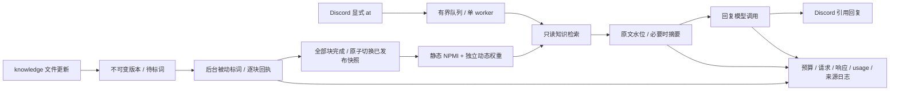

# Indeces_memory_manager

一个名为 **Indices** 的小型 Python 无头智能体：一个 Discord Bot 连接、一个串行消息 worker、GPT-6-Luna adaptor、本地知识库、动态 Hebbian 标注词网络，以及可检查的输入输出 scratch log。项目仓库名保留 `Indeces_memory_manager`。

只处理指定服务器中人类显式 `@Bot` 的文字消息，并回复一条 Discord 消息。短期上下文按频道隔离。没有工具执行、MCP、HTTP 服务、网页搜索、日程、主动发言或多 Bot 路由。

**聊天标词和聊天自动入库关闭。** 本地 `knowledge/` 中的 Markdown/UTF-8 文本文件更新才触发后台被动标词。后台维护与回答是独立任务；当前模型传输共享一个串行请求槽，预算互不借用。



## 启动

需要 Python 3.12 或更新版本。Windows / CPython 3.12.14 的历史基线与本版验证进度见 [docs/STATUS.md](docs/STATUS.md)；Windows/Linux 离线 CI 已配置。

Windows 首次安装运行 `setup.cmd`，然后双击 `Indeces-Console.cmd`。已有本地 `.venv`，可直接打开 Console。

跨平台等价命令：

```powershell
python -m venv .venv
.\.venv\Scripts\python.exe -m pip install -r requirements.lock
.\.venv\Scripts\python.exe -m pip install --no-deps -e .
.\.venv\Scripts\python.exe -m indeces init
```

Linux 使用 `.venv/bin/python`。Windows 首次桥接可在 Console 输入 `discord`，或直接运行向导：

```powershell
.\.venv\Scripts\python.exe -m indeces discord
```

向导接收服务器 **Guild ID**、可选频道 ID 和隐藏输入的 **Bot token**。Guild ID 是目标服务器 ID；频道 ID 以逗号分隔，留空保留现有配置，输入 `*` 允许该服务器中所有符合显式 @ 条件的频道。向导展示不含 token 的设置预览，输入 `y` 才保存；取消不应用桥接设置。已有 runtime 持有同一 state 目录的实例锁时，向导拒绝修改。

Guild/频道设置写入 `config.local.toml`，名称同步为 `Indices`；Bot token 只在 Windows 以当前用户 DPAPI 加密，保存到相邻的 `config.local.discord.secret`，并绑定该 Guild ID。它不能作为明文配置迁移到其他 Windows 用户或系统。密钥不进入配置、scratch 或仓库。终端无法保证隐藏输入时拒绝回显输入；损坏或不匹配的旧凭据可在向导里提供新 token 修复。其他平台没有持久化明文回退，可手动设置配置中的 Guild/频道 ID，并使用环境变量或启动时的隐藏输入。

**向导只做本地设置，不连接 Discord、不验证 token 是否被 Discord 接受，也不启动服务。** 保存后在 Console 明确执行 `start`。启动时 Discord token 来源按 `DISCORD_BOT_TOKEN` 环境变量 → 与配置 Guild 匹配的已保存 token → 本次会话隐藏输入的顺序选择。OpenAI API key 仍由 `OPENAI_API_KEY` 环境变量或每次启动的隐藏输入提供，不持久化。不读取 Yuki 的秘密配置。`.env.example` 只说明变量名，不自动加载 `.env`。

```powershell
.\.venv\Scripts\python.exe -m indeces
```

Console 命令：`discord`、`start`、`status`、`scratch`、`quit`。`start` 在前台运行；Ctrl+C 停机并返回 Console。无头启动也可用 `python -m indeces start`。`status` 是配置和持久状态快照，不保证服务当前在线。

Bot 需提前通过 Discord 的服务器安装流程加入目标服务器；向导不创建或邀请 Bot。Token 来自 Developer Portal 的 Bot 页面，安装步骤见 [Discord 官方入门](https://docs.discord.com/developers/quick-start/getting-started)。Bot 需接收服务器消息事件，并具有 View Channel、Send Messages、Read Message History [频道权限](https://docs.discord.com/developers/topics/permissions#permissions-bitwise-permission-flags)；在线程中回复还需 Send Messages in Threads。显式提及应用的消息正文可使用 Message Content intent 的例外；本实现不申请该特权 intent。[Discord Gateway](https://docs.discord.com/developers/events/gateway#message-content-intent)

## Indices 人设与记忆测试

默认提示词把 Indices 设为平静、好奇、温和且简洁的对话伙伴，使用当前用户的语言回复。目标是帮助观察 Hebbian 治理下的长期召回表现；日常交流不会自动改成测试报告。

回答必须区分当前消息、最近对话/连续性摘要、带来源的长期知识和一般知识。涉及召回问题时，使用长期知识需引用本轮提供的 `[M1]` 一类标记，它们在运行记录中绑定实际来源 ID；没有相关长期证据时说明未检索到，不编造记忆、来源、图权重或测试结果。知识文件中的说法仍需保留来源、冲突和不确定性。

人设不把单次回答当成 Hebbian 有效性的证明，也不声称已把聊天保存为长期知识。测试长期记忆需由用户更新本地知识文件，再对照检索证据、来源版本与 scratch 记录；当前版本没有自动评测结果。

## 知识库与标词

把 `.md`、`.markdown` 或 `.txt` 文件保存到 `knowledge/`，允许子目录。服务运行期间持续观察目录，默认每 0.5 秒检测稳定文件快照；不用每次手动触发标词。关闭服务时不观察文件，更新会在下次启动时检测。

1. 保存文件原文、路径、SHA-256 和不可变版本，记录当前服务器范围内待处理的文件版本。
2. 按最多 400 个字符分块，后台只让模型返回标注词，保持原文不变。Console 显示排队、开始、逐块进度、完成或失败回执，包含路径、版本/来源 ID、digest 和当前供新检索使用的已发布版本；进度回执显示已标注/总块数，结束回执显示已知输入/输出 token 与耗时。未知远端 usage 在 scratch 中明确标记，不能把累计已知计量当成完整账单。
3. 文件编辑后，新版处于 `pending`、`labelling` 或 `failed` 时，已有的完整版本继续参与回答：**旧原文、旧标注词、旧来源 ID 整体保留**。新文件在首次完成前没有可供回退的已发布版本。不会把正在编辑的原文配上旧标签。
4. 所有块通过标签校验、文件 digest 再次核对及预算检查后，在同一 SQLite 事务中撤回旧版记录、添加新版记录，并更新已发布指针和 `ready` 状态。失败不提前切换，也不发布部分块。

每次检索使用当时已发布的完整来源快照。已取证并等待模型的回复保持自己的来源快照与 trace；文件删除或发布切换影响下一次检索，不取消已经开始的回复，也不能保证即时撤销其引用。知识库对指定服务器的允许频道共享；聊天历史仍按频道隔离。待处理版本与已发布版本均按服务器范围记录；切换 Guild 后，不把另一服务器中相同文件 digest 当作本范围已完成索引。

保留旧版只适用于有效文件的正常编辑。**删除文件或清空为仅含空白的文本，会在下一次目录检测时撤回旧已发布版本**。无效 UTF-8、超出文件大小限制、越界路径等保留既有撤回策略；文件总数超限时撤回该范围的索引并暂停处理。归档原文和来源仍保留作审计，归档证据与陈旧动态边不能重新取得检索资格。

后台模型请求和聊天消息不互相调用。没有知识更新时，不调用标词模型。标词不产生 Hebbian 强化；只有回答路径中的实际字面标注词命中产生检索事件。新知识变更在模型繁忙时排队，默认 0.5 秒是检测间隔，不是承诺的模型完成延迟。

后台观察或标词任务因日志等异常退出时，Console 明确报告“知识库后台已暂停”，配对的后台任务也会停止，已发布知识保留；不会在标词任务已停止时继续静默排队。修复文件/日志权限后需要停机重启，未知用量的请求不会自动重发。

默认每个文件最多 8192 字节、最多 128 个文件。单知识版本另有 360 秒、65536 输入 token、16384 输出 token 的累计熔断上限。某版本失败时保留原文、已知 usage 和失败原因，不自动无限重试；修改文件内容形成新 digest 后重新触发。新版本失败期间，仍有完整旧发布版本时继续使用旧版。

0.3.0 启动时迁移已有状态：仍属于旧当前 head、归属明确、`ready` 且已有完整 active 来源的版本可直接登记为已发布版本，不重复标词；已经归档或已脱离旧 head 的证据不会重新激活。范围归属或用量无法确认的旧待处理记录会隔离并打印回执，需要用户编辑文件内容形成新 digest 后再触发。未知用量的中断版本也不自动重试，避免重启掩盖预算或重付费风险。

网络采用用户指定的参考仓库策略，并接入经批准的动态在线排序。完整的“参考基线 → 实现”表见 [docs/BASELINE.md](docs/BASELINE.md)。动态公式保留 `η=1`、`λ=.99`；本版把一次有直接命中的实际检索定义为一个衰减周期，因此衰减速度取决于检索次数，不是按日。来源支持、单跳门控、旧版本归档与事件幂等均有离线回归测试；检索相关性尚未做真实数据评估。

## 调用预算

配置属于 `adapter.budgets`，固定模型 `gpt-6-luna`。目前使用官方 OpenAI Responses API；没有工具、服务端会话、后台生成或自动重试。模型 ID 与接口依据 [OpenAI Luna 文档](https://developers.openai.com/api/docs/models/gpt-6-luna)。

| 独立阶段 | 最大输入 token | 最大输出 token | 时间上限 | reasoning |
|---|---:|---:|---:|---|
| 后台 label | 4096 | 512 | 15 秒 | none |
| 条件式 summary | 16384 | 2048 | 20 秒 | none |
| reply | 16384 | 2048 | 45 秒 | low |

各阶段先串行调用 `/responses/input_tokens`，超限不发生成请求；然后最多一次 `/responses`。计量请求与生成共享该阶段时间上限。输出上限包含模型不可见的生成 token，返回 usage 再次校验。具体接口见 [输入计量](https://developers.openai.com/api/reference/resources/responses/subresources/input_tokens/methods/count) 和 [Responses](https://developers.openai.com/api/reference/python/resources/responses/methods/create)。

一条普通聊天通常为 1 次计量 + 1 次回复；触发摘要时为 2 次计量 + 2 次生成。每个后台文本块为 1 次计量 + 1 次标词。模型调用没有并行 HTTP 请求，token 额度不借用，失败不扩额或隐式重试。每种阶段各自连续失败 3 次后冷却 30 秒；冷却结束只由新的实际任务重新尝试。

聊天处理另有 100 秒总上限、120 秒队列等待上限、10 秒 Discord 发送上限。固定失败回执也受剩余聊天时间约束。超时取消本地网络等待，无法保证远端立即停止生成或免除已消耗费用；日志明确标记未知 usage。

SQLite 扫描有协作式 5 秒检查；Python 图排序、文件 I/O 和 fsync 不是可被 asyncio 强制抢占的操作。因此模型异步调用和队列具有时间取消上限，任意规模本地计算尚不具备操作系统级硬时限。默认文件范围用于保持本体小型；扩大范围前需测量。

## 短期上下文

参考 Yuki 的整轮水位机制：先扣除固定提示、当前消息、知识证据、完整摘要预留，再计算原文容量。高水位为该容量的 100%，低水位为 70%。溢出时摘要连续最旧的完整互动，尽量把保留的最新后缀降到低水位；每轮最多一次摘要调用。

摘要保存 checkpoint ID、上一 checkpoint、实际覆盖的原文 seq 和 trace ID。失败不推进边界，原文一直保留。积压超过一次维护预算时明确拒绝当前回复并记录积压，不跳过旧证据，不无限循环摘要。只保存 Discord 确认送达的实际文本到 assistant 历史；超长回复显式截断，完整输出可在日志的 24 小时保留窗口内查阅。

## Scratch log 与复现

Console 输入 `logs` 可查看人类可访问的 scratch 目录，包含固定说明 `README.md`、入口页 `index.html` 和原始日期 JSONL。Console 输入 `observe`，或另开终端执行 `python -m indeces observe`，打开打印的本机 URL：交互查看 NPMI 图、动态/有效权重、来源版本、逐步学习/衰减记录，以及最近 24 小时的可读运行 trace。`start` 也会显示观察 URL，服务停止时自动关闭该页面服务。

图支持搜索、拖动、缩放和分层切换；选边可查来源、权重时间线与触发查询。没有有效来源的历史动态边明确区分，不能据此取得检索资格。当前逐轮治理基于字面命中，尚未增加逐轮语义权重调整；NPMI 与动态权重不是同一个量，动态值可以超过 1。网页不增加模型调用，详细使用和读取边界见 [docs/OBSERVABILITY.md](docs/OBSERVABILITY.md)。

`scratch/YYYY-MM-DD.jsonl` 记录规范化前后的 Discord 输入、调用目的、完整已发送请求、完整成功响应、计量结果、预算、usage、耗时、检索证据、知识版本、摘要覆盖、实际 Discord 输出和回执 ID。日志不要求或生成隐藏思维链。

0.4.0 另冻结每轮实际召回的全文/quote/标注词、来源版本与当时发布指针、模型可见材料、图权重逐步变化和排名依据。图提交后立即写权重回执，避免后续材料冻结失败只留下无解释的权重改变。完整模型输出与 Discord 实际送达文本分别记录 `[M1]` 一类标记的段落、位置和来源绑定。可据此区分材料被召回、出现字面引用，以及尚未自动评估的语义支持；引用存在不证明材料正确或结论受其支持。来源解码文本的 hash 可以重算，原文件字节 digest 只是保留的元数据，不宣称已验证原字节。

每条记录有连续序号、UTC 时间、前一 hash 和当前 hash，追加后 flush/fsync；拒绝重复 JSON 键、非有限数和无效外层结构。`python -m indeces scratch` 同时检查 hash 链、每轮记录合同与 adaptor 调用：核对计量/生成输入、响应、门禁、预算、usage/时间和输出，分别显示完整、失败、不完整、无效和旧版记录，并显示无法解析的引用告警；不增加模型调用。详细字段、检查范围与查阅方法见 [docs/RUN_RECORDS.md](docs/RUN_RECORDS.md)。

0.5.0 默认按每条记录的 UTC 时间滚动保留 **24 小时**，启动时与服务运行期间每 60 秒清理，空闲也执行；停服期间不清理，下次 `start` 先清。到期条件为 `timestamp <= now - 24h`，不会等到自然日结束，也不把未到期内容随整文件删除。保留行的原 sequence/hash 不改，用同文件首行无原文 retention checkpoint 声明已清前缀及跨窗口 ID。跨窗口的调用/回答显示 `retention_partial`，不冒充完整记录；清理数量和 cutoff 有 Console 回执。`scratch` 校验命令只读，不执行清理。

清理限于 scratch 日期 JSONL 和专有替换临时文件，不归档到期日志；本地知识、SQLite 消息/版本/checkpoint 与图审计仍按各自持久策略保存。清理前校验，拒绝损坏链、链接/越界路径和时钟回拨。单文件替换原子，整个目录不是一个事务；失败可能留下显式 `cleanup_pending` 检查点，服务停止并报告，不声称完成清理。不会新增模型请求或外部定时任务。

可能已写入后的 I/O 失败会禁止当前日志 writer 续写并保留原文件，不自动修复。图审计与权重在同一 SQLite 事务内提交；scratch fsync 是另一边界，不能称为跨数据库/日志原子。已经收到的 Discord 送达确认不会因后续审计失败改称网络未知或自动重发。

hash 链可以检测局部损坏，没有外部锚点，不能证明整条日志未被重写、删除或在完整行边界截去尾部；完整记录合同也不等于语义核验或长期召回效果评估。

`state/memory.sqlite3` 保留原文、版本、标签、静态边、独立动态权重、检索事件、周期、消息与 checkpoint。单实例内核锁阻止同一 state 目录被两个服务使用。重启将未完成聊天标为不可自动重放；发送超时不自动重发，因为 Discord 可能已经接收。

本地知识、数据库、scratch、秘密和私有配置均由 `.gitignore` 排除。代码更新上传到私有 [GitHub 仓库](https://github.com/simulacrum0112-afk/Indeces_memory_manager)。

## 验证

```powershell
.\.venv\Scripts\python.exe -m unittest discover -s tests -v
.\.venv\Scripts\python.exe -m indeces check
```

当前交付状态与真实/离线验证边界见 [docs/STATUS.md](docs/STATUS.md)。未通过真实 Discord 往返、账号模型访问或真实知识集的召回评估前，不把这些能力写成已验收。
