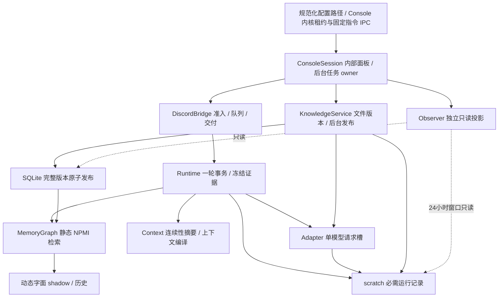

# Indeces 架构与调试合同

文档基线：0.12.4；2026-10-02 核对。远端提交、CI 与验证范围见 [CHECKPOINT.md](CHECKPOINT.md)。

本页描述 0.12.4 的实际职责、状态归属和验证边界。Indeces 是一个有检索增强的固定对话工作流；模型负责标词、必要的连续性摘要与回答，以及是否回复当前机器人消息；代码决定准入、证据版本、预算和交付。

材料冻结负责两种明确用途：完整图/来源证据供 scratch 审计，固定字段的 `citation_material_v1` 视图供模型回答。视图保留原 quote、来源 ID、引用与 PDF 页码；支持记录清单等随图增长的证据不进入模型。独立校验从材料/候选重建该视图，并核对实际输入；旧完整视图保持历史验证兼容。检索选择、图公式、完整审计、预算和摘要策略保持，不能将省去审计元数据解释成提高模型额度。

机器人准入使用 `BotConversationGate` 的 SQLite 事务：先只读检查，写入 scratch 排队记录成功后，在无 await 的路径内持久预占，再交给单 worker。每个频道/机器人最多五次机会，跳过、失败、排队过期或停止也占次；新接受的人类显式 @ 输入重置同频道全部机器人，重复输入不重置。首次迁移先备份旧 SQLite，重连/重启保留去重与额度。数据库或排队审计失败关闭准入并触发服务故障，不继续消耗模型。scratch 与 SQLite 不属于同一事务，进程崩溃可留下排队记录缺少后续处理；已有预占不自动重放。

机器人回复使用既有 reply 阶段的单次 JSON schema 输出（`action=reply|skip`、`text`），同一次请求完成是否回复的判断，未增加预算或请求槽。静默跳过仅保存输入、决策、模型用量和 `skipped` 结束记录，不保存 assistant 回答或伪造送达；输入可继续用于频道短期上下文。检索或模型失败仍为 failed；剩余总轮时间允许时，机器人通过 `FailureNotice` 发送固定失败回执。传输层以类型区分回执与模型回答，不按文本前缀猜测；回执关闭全部提及且不添加对方 @，不触发下一轮。轮次不退还，送达尝试失败不重发；已经尝试发送模型回答时不再补发回执。总轮时间耗尽则记录回执跳过，不扩大预算。前四次交付由传输层插入唯一对方提及，第五次剔除对方字面提及并关闭所有通知；实际文字与模型原输出分别记录。完整审计独立绑定原始模型 JSON 与已解码答案/静默结果，跨 24 小时仍适用原有 partial 合同。模型能选择跳过不证明实际收尾判断质量已验收。

0.12.2 的本地检索只生成一次规范化不可变 `CanonicalSnapshot`：scratch 将同一份审计 bytes 嵌入原 JSON 字段，材料冻结独立解码到新字典并复用原摘要，再独立重新编码校验摘要。普通 scratch 写入和普通字典冻结保留原路径；完整日志字节/hash 链、图排序/公式/来源门禁及 5 秒预算不变。context 字面匹配缓存仅在当前 `_selection` 调用内存在，保留原 `_hit` 规则，不跨消息或 scope 缓存。

行业参考采用 [Anthropic 的简单可组合工作流原则](https://www.anthropic.com/engineering/building-effective-agents) 与 [OpenTelemetry 对指标、日志和 trace 的区分](https://opentelemetry.io/docs/concepts/observability-primer/)。这是设计取舍，不是已证明提高真实召回效果的实验结论。本版不引入新的框架或遥测依赖。

本地只读参考了 Yuki 已跟踪的 `docs/ARCHITECTURE_CURRENT.md`、`docs/architecture/ARCHITECTURE_INVARIANTS.md` 和 `docs/CALL_ARCHITECTURE_V2_CONTRACT.md`，借用单一生命周期 owner、窄职责接口、未知外部结果不重发以及先停止准入再清理的思路。没有继承 Yuki 的工具、多能力路由或预算，没有读取其私有配置和运行数据。

| 职责与代码 | 唯一负责的事实或边界 | 失败处理 |
|---|---|---|
| `ConsoleInstance` / `ConsoleSession` | Console 内核租约、固定指令通信、导航、后台线程和输出面板 | 竞争入口复用同一 owner；退出清理通信，异常退出后的新 owner 恢复端点；不按 PID 停止其他进程 |
| `console.serve` | 实例租约、装配与清理；一个 Gateway | 先停止任务使用者，再关闭资源；退出后释放租约 |
| `ingest.retry_ingestion` | 显式选中的失败/未完成知识续跑；不连接 Discord、不新增发现范围 | 保留块 checkpoint 与已知计量；未知 usage、预算耗尽或原文件改变时阻止续跑 |
| `DiscordBridge` / `BotConversationGate` | 显式提及门禁、机器人五次持久准入、有界队列、worker、远端交付回执 | 忽略自身/webhook；重复不占次；人类新准入重置同频道；未知交付不自动重发 |
| `Runtime` | 每轮 scope、证据冻结、上下文、生成与交付的状态关联 | 已确认回执不能被后续审计失败改成未知；失败提示不调用模型 |
| `KnowledgeService` | 目标版本、逐块标词、已发布指针 | 有效更新失败保留上一完整版本；删除/非法输入遵循撤下合同 |
| `OpenAIAdapter` | label/summary/reply 三阶段准入与计量；一个请求槽 | 各阶段独立熔断，不换模型、不借预算、不隐式重试 |
| `Observer` / `observer_data` | 持久状态、全范围统计、受限图与最近 trace 的只读投影 | 读取故障标为不可用；不变更业务状态，不占用模型槽 |
| `knowledge_audit` / `knowledge_progress` | 完整当前文件审计 / 有界持久状态进度 | 保存错误与当前校验预测分开；不迁移、调用模型或把存储状态当在线证明 |

`Store` 是事实持久化实现，`MemoryGraph` 负责统计和来源门控，`Context` 编译输入。SQLite 写事务在共享 event loop 中同步完成，不在事务中等待模型。scratch 是用户要求的可核验运行合同，不能按可丢弃的普通遥测处理；指标与图页面也不能替代它。

模型槽等待仍计入原阶段总时限。纯等待超时记录 `model_slot_timeout` 和实际等待时间；没有发出生成时不误报未知生成 usage，也不把本地拥塞当供应商故障。已发生成但无合法 usage 时保留未知标记；合法 usage 已返回而输出失败时，实际用量仍必须入版本累计，不发布不合格标签或回答。这修正计量分类，不解决长回复占槽造成标词等待耗尽的策略取舍，不扩大时间或并发。

0.11.0 标词的本次有效输入门禁为原阶段上限与剩余版本输入额度的最小值，使用既有 `/responses/input_tokens` 计量后决定是否生成。这项门禁修复本身不扩额，阶段输入预算、完整输出上限预留及阶段时限不变；scratch 绑定 requested/effective/stage cap，供应商实际 usage 超过有效门禁仍保存已知用量并拒绝发布。标签 schema 的 `items.maxLength=40` 与本地校验对齐，均要求 1–8 个非空词、每词最多 40 字符。

单知识版本累计 input/output/seconds 另经用户明确批准，从 65536/16384/360 调整为 196608/49152/1080，属于运行/恢复资源额度，不涉及物理模型/PES；400 字符块、每块4096/512/15秒、模型、effort 与单请求槽不变。旧显式配置不由加载器覆盖；已授权迁移必须先备份、持有 state 租约并等待活动任务结束，不能热补丁运行请求。

已有知识数据库首次增加 `knowledge_file_audit` 元数据表前，通过 SQLite backup 在相邻 `migration_backups/` 建立一致快照（包括已提交 WAL），不覆盖已有备份。该迁移补充文件格式、大小、阶段、错误和未知 usage 状态，保留原版本、记录、索引与 checkpoint；只读 audit 不触发迁移。

## 单一 Console 与后台任务

Console 以规范化配置路径区分 owner，内核租约判定存活；临时端点文件只用于发现通信地址，不以 PID 或文件存在性推断所有权。重复入口通过本机 loopback 鉴权的固定指令队列切换功能；没有通用 shell 执行或 HTTP 写接口。正常退出清理端点和租约，进程异常退出后内核释放租约，新 owner 替换陈旧端点。Windows 聚焦为可见控制台窗口的尽力操作，宿主不支持时明确说明。

`start` 持有原 state 实例锁，从主线程隐藏凭据输入直到后台任务完成清理；服务有独立线程与 event loop，SQLite 和模型槽仍由该 loop 拥有。`knowledge`、`observe`、`audit`、`npmi`、`scratch` 等在同一 Console 中导航；audit/npmi/scratch 通过独立只读面板线程执行，重复调用运行中的同名任务仅复用结果。任务输出在内存中保留最多 5000 行，面板显示最近 100 行并说明省略；`--once` 在调用终端输出完整只读报告，完整审计另由 scratch 保留。

`stop`/Ctrl+C 只请求停止本 Console 拥有的任务，清理期间继续保留资源租约。活跃任务使 `quit` 明确拒绝退出；先 stop，待完成清理后再 quit。EOF 时保留活跃任务和通信 owner，使另一入口仍可 stop；任务完成后退出。不误停其他 Console、旧服务或 `start --headless` 前台实例。强制结束进程仍不能保证最后计量回执完整。

没有活动服务时，显式 `retry` 启动选定失败/未完成来源的维护线程，不启动 Discord 或新文件监听；有本 Console Gateway 时，把请求送回原知识 loop 和模型槽。正常完成的 ready 版本不重做，成功块不重标，累计输入/输出/时间不重置。运行中的维护任务不会因导航或重复 retry 追加目标。

0.12.3 的私有检索索引缓存每个 scope 的完整活动记录、已知词、按记录计数的频次、mark→原记录序号和边→原插入序号/邻接/审计字典序。静态邻居顺序仅在材料变更后构建，显式动态模式仍使用本轮新权重排序。两个前缀树从 query 寻找候选标签，Latin 保留 Python IGNORECASE 的 Unicode 特例，非 Latin 保留 casefold 子串规则；候选仍由原 `_hit` 确认，最终 literal 排序与原实现相同。一跳扩展仍只遍历原 direct hits，保留全部邻居决策审计，前五邻居/两额外词/三出处限制不变，未新增二跳或提前截掉审计候选。

材料缓存由连接内 TEMP revision/触发器按 scope 跟踪 records/static/support 的变更，覆盖发布、归档、同连接其他 Graph 与直接 SQL、跨 scope REPLACE；不新增持久表或修改历史证据。其他连接提交由 data_version 检查，DDL、连接和 self marks 改变也失效。读取在原 BEGIN IMMEDIATE 内验证；事务回滚/异常清空，提交期间材料再变更则不保留索引。聊天状态与 shadow 写入不使静态缓存失效。输出复制 marks/context/来源 ID，调用者不能污染后续查询。

完整 edge_statistics、mark_frequencies、changed_edges 与 ranked_candidates 仍保持原字段/数量/顺序及规范字节；逐轮全动态边 decay、Python round、last_event_id 和源门禁不变。完整审计字节数 B 与动态边 D 仍要求至少 O(B+D) 工作；前缀查询在 trie 上按查询长度和最长匹配前缀访问，候选选择只触达命中邻接与 allowed postings。这是局部查找复杂度的减少，不等于全链路无全局工作。材料发布额外 TEMP revision 写入有已测成本，性能证据必须同时报告冷/暖查询和摄入。

0.12.6 静态暖查询进一步用 `_query_edges` 只物化全部 direct-hit incident edges，`edge_statistics_scope=direct_hit_incident_v1` 声明相关统计范围；全部接受/拒绝的一跳决策和排名证据保持字节一致。完整频次/全图数量与全 shadow transitions 仍保留，显式 dynamic 和历史类型 fallback 保留旧全图路径。审计整包/hash 因范围声明改变；旧事件不重写，独立校验按范围声明或旧完整合同分支。范围、证据和全链路尚存成本见 [MEMORY_QUERY_SCOPE.md](MEMORY_QUERY_SCOPE.md)。

## 静态检索与动态观察

自 0.10.0 起，`Runtime.process` 明确指定 `ranking_mode="static"`；低层 `retrieve` 默认也为静态。0.11.0 保留这项行为：只用已保存的正 NPMI 边做有来源支持的一跳扩展及排序，直接命中仍优先。`dynamic_score` 只表示字面共触发的 shadow 观察值，不能影响当前扩展或排名；仅有共现支持但无可用正静态权重的词对也不能从动态层绕过门控。原始正值舍入为零时也属于无可用正权重，未改既有四位舍入规则。

动态权重、历史、η=1、λ=.99、事件幂等和已有数据库均保留。低层显式动态接口仍用于离线兼容测试；产品配置和回复路径没有动态启用开关。将来上线需要代表性对照评估和新的用户决定。

审计发现 ≤0.9.3 的实现接线与当时“仅静态”文档不一致：`retrieve` 会选择动态有效权重。旧记录必须按其实际动态算术解释，不能作为静态检索实验。新审计与每份冻结模型材料同时记录 `ranking_mode`、`weight_basis`；旧无模式记录按旧合同兼容校验，不修改历史。同事件 ID 不允许跨静态/动态模式重放；旧无模式事件属于 legacy dynamic。新代码只在新进程加载后生效，不热补丁运行实例。

## 生命周期与实际送达

发送之前记录尝试；超时、断开或未获得回执时仍是未知外部结果。获得 Discord 返回的 message ID 后，真实 `DeliveryReceipt` 必须传给 Runtime。随后审计失败会保留 `delivered` 历史、关闭新准入并传播故障；不能再发送一条回答，也不能把确认状态降为未知。

Gateway 运行时同时监督 worker。worker 的必需审计崩溃不再留下“Gateway 在线但永久不能回答”的静默状态。停止时逐条结算队列，审计写失败不能跳过后续队列清理或 worker 取消。

原有关闭等待限额仅是取消与告警检查点。如果一个异常协程拒绝取消，关闭继续等待实际退出，保留底层资源与实例租约；它们不能在 worker 仍活跃时被释放。重复取消关闭等待者不能跳过清理。Python 协作式取消、SQLite VM 检查和本地 I/O 都不是操作系统级硬抢占；强制关闭窗口仍不能保证完整回执。

## 静态 NPMI 诊断和质量验证

Console `npmi` / CLI `python -m indeces npmi --once` 只读当前配置范围的 SQLite，显示完整范围的有效块、来源版本、标注出现次数、去重词节点、正边、孤立词、单块/单来源支持及分数范围；不读 scratch，不启动服务或模型，不创建缺失配置。出现次数按有效记录中每个规范化词计数，同词跨记录重复计数；未发布版本的块标签不能混作已索引统计。观察网页默认显示静态层，图的 500 节点/1000 边展示限额与全范围聚合分开说明；代码没有 3000 词/标注的存储上限，词数增长不证明召回改善或收敛。

NPMI 使用有效标注文本块为共现单位，公式与 4 位舍入未改。高 NPMI、NPMI=1 或多个标注词都不等于高置信度；一个稀有词对仅共现一次也可能达到 1。诊断描述样本结构，不核验标签语义、论文提取质量或回答支持。

下一步真实评测应先由用户选定代表性问题与可用来源，冻结版本，记录直接命中、静态扩展、前三召回、失败/空召回与字面引用，再人工判断相关性、支持范围和冲突。当前没有此评测结果，不增加相似度模型或自动语义评审调用，也不据稀疏性自动改阈值、块宽、模型或预算。

## 已知限制

- 0.11.0 label 请求 schema 与本地合同均约束 1–8 个非空白字符串和每词最多 40 字符。此前缺少 schema 长度门禁能够解释某些格式拒绝，但不能证明所有历史 `invalid_labels` 都由它造成。代码与合成测试不能代替真实远端验收或标签语义评估；失败版本只在显式 retry 且满足恢复条件时续跑。
- 单请求槽使后台标词与回答排队，生产延迟、断网和 rate-limit 仍需真实测试。
- 整篇原子发布保护版本一致性，不证明 PDF 公式、双栏顺序或标签质量。
- 存储状态、持锁、观察 URL 可访问均不证明 Gateway 已连接；页面刷新失败不会被“暂停”按钮改成健康。
- 24 小时窗口外的 scratch 原文不恢复、不归档；知识与图历史独立保留。

离线验证与本版交付记录见 [STATUS.md](STATUS.md)。
