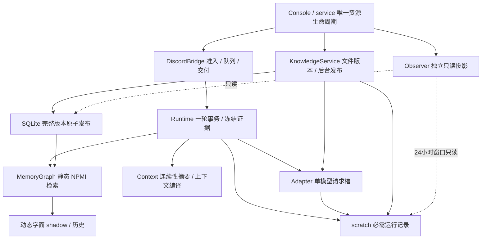

# Indeces 架构与调试合同

本页描述 0.10.0 的实际职责、状态归属和验证边界。Indeces 是一个有检索增强的固定对话工作流；模型负责标词、必要的连续性摘要与回答，代码决定准入、证据版本、预算和交付。

行业参考采用 [Anthropic 的简单可组合工作流原则](https://www.anthropic.com/engineering/building-effective-agents) 与 [OpenTelemetry 对指标、日志和 trace 的区分](https://opentelemetry.io/docs/concepts/observability-primer/)。这是设计取舍，不是已证明提高真实召回效果的实验结论。本版不引入新的框架或遥测依赖。

本地只读参考了 Yuki 已跟踪的 `docs/ARCHITECTURE_CURRENT.md`、`docs/architecture/ARCHITECTURE_INVARIANTS.md` 和 `docs/CALL_ARCHITECTURE_V2_CONTRACT.md`，借用单一生命周期 owner、窄职责接口、未知外部结果不重发以及先停止准入再清理的思路。没有继承 Yuki 的工具、多能力路由或预算，没有读取其私有配置和运行数据。

| 职责与代码 | 唯一负责的事实或边界 | 失败处理 |
|---|---|---|
| `console.serve` | 实例租约、装配与清理；一个 Gateway | 先停止任务使用者，再关闭资源；退出后释放租约 |
| `DiscordBridge` | 人类显式提及门禁、有界队列、worker、远端交付回执 | worker 故障关闭准入并终止 Gateway；未知交付不自动重发 |
| `Runtime` | 每轮 scope、证据冻结、上下文、生成与交付的状态关联 | 已确认回执不能被后续审计失败改成未知；失败提示不调用模型 |
| `KnowledgeService` | 目标版本、逐块标词、已发布指针 | 有效更新失败保留上一完整版本；删除/非法输入遵循撤下合同 |
| `OpenAIAdapter` | label/summary/reply 三阶段准入与计量；一个请求槽 | 各阶段独立熔断，不换模型、不借预算、不隐式重试 |
| `Observer` / `observer_data` | 持久状态、全范围统计、受限图与最近 trace 的只读投影 | 读取故障标为不可用；不变更业务状态，不占用模型槽 |

`Store` 是事实持久化实现，`MemoryGraph` 负责统计和来源门控，`Context` 编译输入。SQLite 写事务在共享 event loop 中同步完成，不在事务中等待模型。scratch 是用户要求的可核验运行合同，不能按可丢弃的普通遥测处理；指标与图页面也不能替代它。

模型槽等待仍计入原阶段总时限。纯等待超时记录 `model_slot_timeout` 和实际等待时间；没有发出生成时不误报未知生成 usage，也不把本地拥塞当供应商故障。已发生成但无合法 usage 时保留未知标记；合法 usage 已返回而输出失败时，实际用量仍必须入版本累计，不发布不合格标签或回答。这修正计量分类，不解决长回复占槽造成标词等待耗尽的策略取舍，不扩大时间或并发。

## 静态检索与动态观察

0.10.0 的 `Runtime.process` 明确指定 `ranking_mode="static"`；低层 `retrieve` 默认也为静态。静态路径只用已保存的正 NPMI 边做有来源支持的一跳扩展及排序，直接命中仍优先。`dynamic_score` 只表示字面共触发的 shadow 观察值，不能影响当前扩展或排名；仅有共现支持但无可用正静态权重的词对也不能从动态层绕过门控。原始正值舍入为零时也属于无可用正权重，未改既有四位舍入规则。

动态权重、历史、η=1、λ=.99、事件幂等和已有数据库均保留。低层显式动态接口仍用于离线兼容测试；产品配置和回复路径没有动态启用开关。将来上线需要代表性对照评估和新的用户决定。

审计发现 ≤0.9.3 的实现接线与当时“仅静态”文档不一致：`retrieve` 会选择动态有效权重。旧记录必须按其实际动态算术解释，不能作为静态检索实验。新审计与每份冻结模型材料同时记录 `ranking_mode`、`weight_basis`；旧无模式记录按旧合同兼容校验，不修改历史。同事件 ID 不允许跨静态/动态模式重放；旧无模式事件属于 legacy dynamic。新代码只在新进程加载后生效，不热补丁运行实例。

## 生命周期与实际送达

发送之前记录尝试；超时、断开或未获得回执时仍是未知外部结果。获得 Discord 返回的 message ID 后，真实 `DeliveryReceipt` 必须传给 Runtime。随后审计失败会保留 `delivered` 历史、关闭新准入并传播故障；不能再发送一条回答，也不能把确认状态降为未知。

Gateway 运行时同时监督 worker。worker 的必需审计崩溃不再留下“Gateway 在线但永久不能回答”的静默状态。停止时逐条结算队列，审计写失败不能跳过后续队列清理或 worker 取消。

原有关闭等待限额仅是取消与告警检查点。如果一个异常协程拒绝取消，关闭继续等待实际退出，保留底层资源与实例租约；它们不能在 worker 仍活跃时被释放。重复取消关闭等待者不能跳过清理。Python 协作式取消、SQLite VM 检查和本地 I/O 都不是操作系统级硬抢占；强制关闭窗口仍不能保证完整回执。

## 静态 NPMI 诊断和质量验证

Console `npmi` / CLI `python -m indeces npmi` 只读当前配置范围的 SQLite，显示完整范围的块数、来源版本、词数、正边、孤立词、单块/单来源支持及分数范围；不读 scratch，不启动服务或模型，不创建缺失配置。观察网页默认显示静态层，图的节点/边展示限额与全范围聚合分开说明。

NPMI 使用有效标注文本块为共现单位，公式与 4 位舍入未改。高 NPMI、NPMI=1 或多个标注词都不等于高置信度；一个稀有词对仅共现一次也可能达到 1。诊断描述样本结构，不核验标签语义、论文提取质量或回答支持。

下一步真实评测应先由用户选定代表性问题与可用来源，冻结版本，记录直接命中、静态扩展、前三召回、失败/空召回与字面引用，再人工判断相关性、支持范围和冲突。当前没有此评测结果，不增加相似度模型或自动语义评审调用，也不据稀疏性自动改阈值、块宽、模型或预算。

## 已知限制

- label 请求 schema 现约束 1–8 个非空白字符串，与既有本地合同对齐；每词最多 40 字符仍由本地校验。官方约束参考 [Structured Outputs](https://developers.openai.com/api/docs/guides/structured-outputs)。这能排除此前 schema 允许的空数组/超量数组，不证明所有历史 `invalid_labels` 都由该缺口造成；没有真实远端 schema 验收，不自动重发失败版本。
- 单请求槽使后台标词与回答排队，生产延迟、断网和 rate-limit 仍需真实测试。
- 整篇原子发布保护版本一致性，不证明 PDF 公式、双栏顺序或标签质量。
- 存储状态、持锁、观察 URL 可访问均不证明 Gateway 已连接；页面刷新失败不会被“暂停”按钮改成健康。
- 24 小时窗口外的 scratch 原文不恢复、不归档；知识与图历史独立保留。

离线验证与本版交付记录见 [STATUS.md](STATUS.md)。
